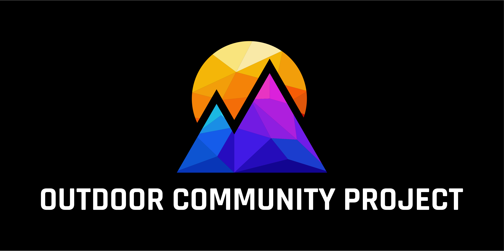
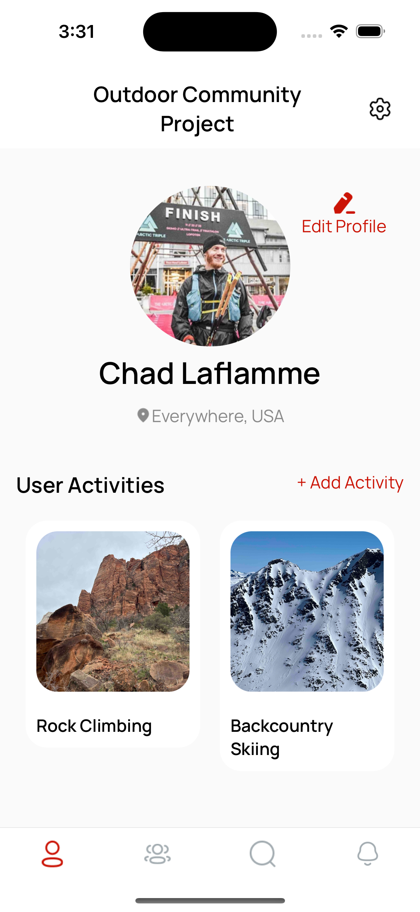
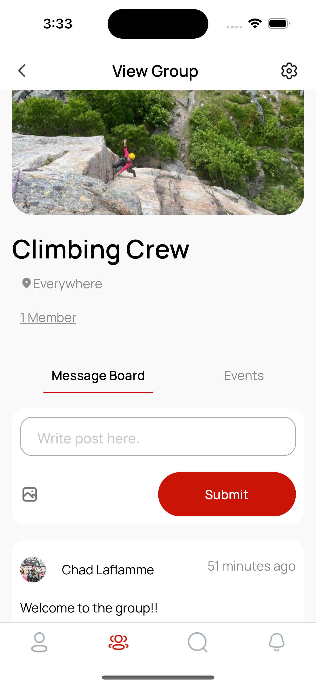
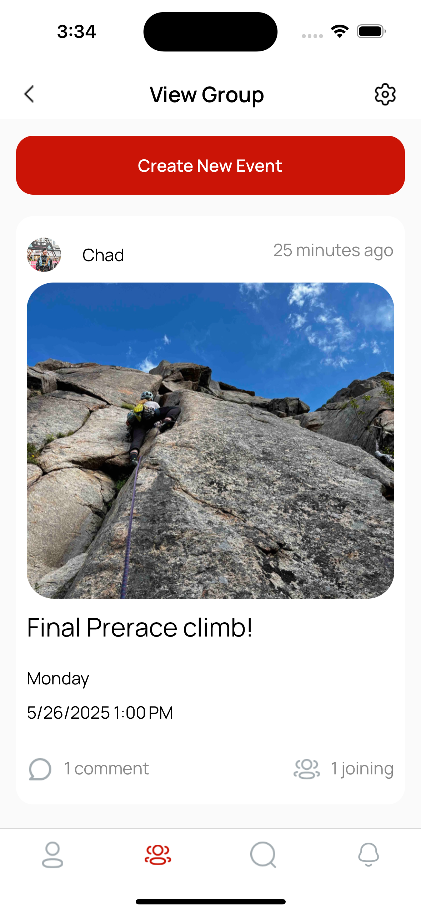
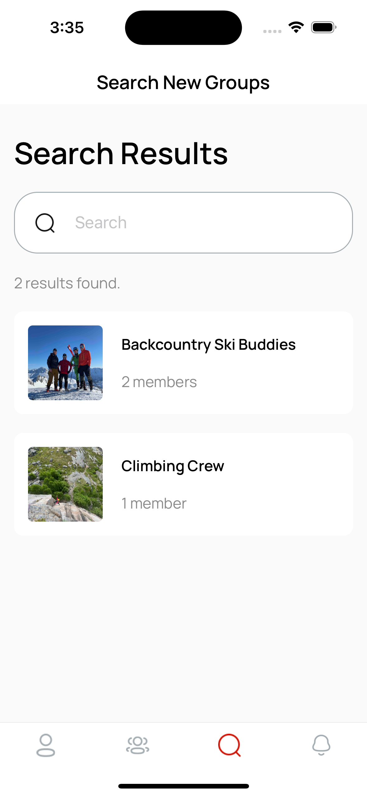

# Outdoor Community Platform (OCP) Mobile App



A retired social networking mobile application designed for outdoor enthusiasts to connect, share experiences, and plan adventures together. This demo version showcases the technical implementation and user experience of the platform.

## 📱 Demo Access

This demo version requires server activation for full functionality. To request access:

1. Contact: chad@redbeardtechnologies.com
2. Provide your name and intended use case
3. I will activate the server and send you a link for a mobile app download

## 🏔️ Features

- User authentication and profile management
- Activity tracking and sharing
- Event planning and group coordination
- Location-based discovery
- Real-time notifications
- Photo sharing and management
- Calendar integration

## 🛠️ Technical Stack

### Frontend
- **Framework**: React Native with Expo
- **Language**: TypeScript
- **State Management**: Redux Toolkit
- **Navigation**: React Navigation
- **UI Components**: Custom components with React Native
- **Styling**: React Native StyleSheet

### Backend (Demo Server)
- RESTful API architecture
- Secure authentication
- Real-time notifications
- Image processing and storage
- Location services

### Key Libraries
- Axios for API communication
- Expo Image Picker for media handling
- React Native Calendars for scheduling
- Redux for state management
- Expo Notifications for push notifications
- Expo Secure Store for data security

## 📸 Screenshots






## 🚀 Getting Started

1. Clone the repository
2. Install dependencies:
   ```bash
   npm install
   ```
3. Start the development server:
   ```bash
   npm start
   ```

## 📊 Project Status

This project was actively developed and maintained from [Start Date] to [End Date]. During its active period, it achieved:
- [X] users registered
- [X] activities created
- [X] successful group events organized

The project was retired due to operational costs and the challenges of maintaining a social platform as a solo developer. The demo version preserves the technical implementation and user experience for portfolio purposes.

## 🏗️ System Architecture

The application follows a modern mobile-first architecture:
- **Frontend**: React Native with Expo for cross-platform compatibility
- **State Management**: Redux for predictable state management
- **Backend**: RESTful API with secure authentication
- **Data Storage**: Secure local storage with Expo Secure Store
- **Real-time Features**: Push notifications and activity updates

## 🛠️ Development Environment

### Prerequisites
- Node.js (v22 or higher)
- npm or yarn
- Expo CLI
- iOS Simulator (for Mac) or Android Studio (for Android development)

### Common Issues & Solutions
1. **Expo Build Issues**
   - Clear cache: `expo start -c`
   - Update Expo CLI: `npm install -g expo-cli`

2. **TypeScript Errors**
   - Run type checking: `tsc --noEmit`
   - Update type definitions: `npm install @types/react @types/react-native`

## 📝 Note

This project is currently in demo mode. The production server has been deactivated due to operational costs. The demo version showcases the technical implementation and user experience of the platform.

## 🔒 Privacy

Please review our [Privacy Policy](PRIVACY_POLICY.md) for information on data handling and user privacy.

## 📧 Contact

For demo access or inquiries:
- Email: chad@redbeardtechnologies.com

## 📄 License

This project is for demonstration purposes only. All rights reserved.

## 🙏 Acknowledgments

Special thanks to:
- Expo team for the excellent development platform
- React Native community for continuous improvements
- Open-source contributors of the libraries used in this project 